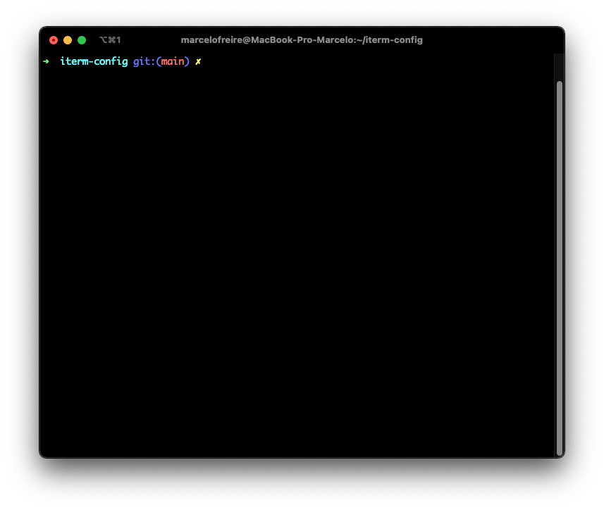
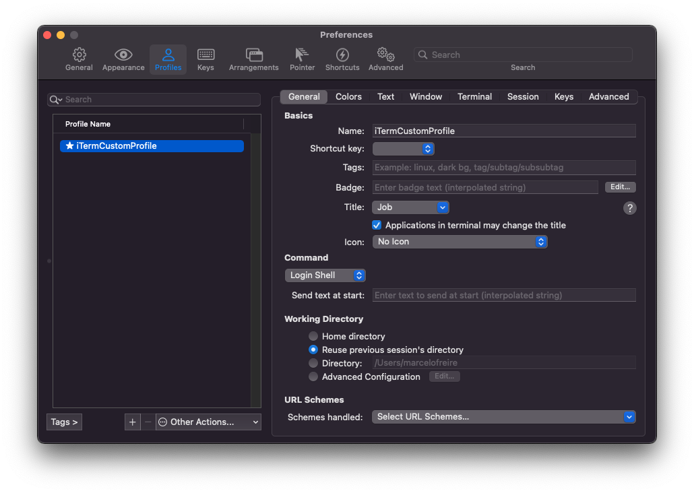

# iTerm2 custom preferences
This repository has my iTerm2 custom preferences and instructions to set them. First step is clone it.

## Loading preferences
Open the iTerm2, go to `Preferences`, you can use the shortcut `command ,`. Go to `General > Preferences` to select `Loading preferences from a custom folder or URL` checkbox and set the path to load preferences. You can set when to save the changes.

## Import JSON profiles
If you need, you can import the profile settings. Go to `Preferences > Profiles` and at bottom of the window you can go to `Other Actions... > Import JSON Profiles...` and select the file `iTermCustomProfile.json` from this cloned repository.

